# Sindh Smart Citizen Portal

Sindh Smart Citizen Portal is a complaint management system for citizens and administrators. Citizens can register, log in, file complaints, track progress, and manage their profile. Administrators can review complaints, update statuses, manage departments, and manage officers.

## Features

### Citizen Portal
- User registration and login
- Citizen dashboard with complaint stats
- Complaint submission and tracking
- Department-wise complaint view
- Profile management and login activity

### Admin Panel
- Admin login and protected routes
- Complaint monitoring and status management
- Department management
- Officer management
- Dashboard overview of complaint counts

## Tech Stack

### Frontend
- React
- Vite
- Tailwind CSS
- Recharts

### Backend
- Node.js
- Express
- Oracle Database
- `oracledb`

## Project Structure

```text
.
├── src/                 # React frontend
├── oracle-backend/      # Express + Oracle backend
├── images/              # App screenshots used in this README
└── README.md
```

## Getting Started

### Prerequisites
- Node.js and npm
- Oracle Database / Oracle XE
- Oracle schema access

### 1. Install frontend dependencies

```bash
npm install
```

### 2. Install backend dependencies

```bash
cd oracle-backend
npm install
```

### 3. Configure environment variables

Create `oracle-backend/.env`:

```env
DB_USER=system
DB_PASSWORD=1234
DB_CONNECT=localhost:1521/xepdb1
AUTH_SECRET=smart-citizen-portal-secret
PORT=5000
```

### 4. Initialize the Oracle schema

Run the SQL file:

```bash
docker exec -i <container_id> sqlplus system/1234@localhost:1521/XE < oracle-backend/schema.sql
```

Or run `oracle-backend/schema.sql` directly in SQL*Plus if Oracle is installed locally.

### 5. Start the backend

```bash
cd oracle-backend
node server.js
```

### 6. Start the frontend

```bash
npm run dev
```

Frontend runs at:

```text
http://localhost:5173
```

Backend API runs at:

```text
http://localhost:5000
```

## Admin Credentials

```text
Email: superadmin@example.com
Password: test1234
```

## Key Routes

### Public / Citizen
- `/`
- `/register`
- `/login?role=citizen`
- `/dashboard`
- `/complaint`
- `/profile`
- `/departments`

### Admin
- `/login?role=admin`
- `/admin/dashboard`
- `/admin/complaints`
- `/admin/officers`
- `/admin/departments`

## Screenshots

### Landing Page

Shows the public homepage with separate citizen and admin login options.

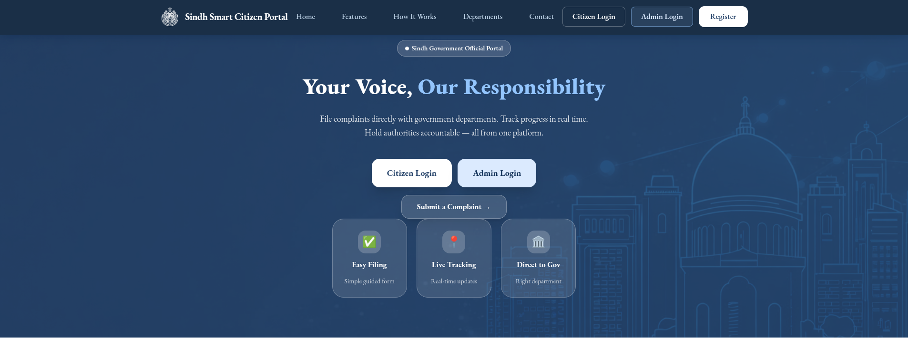

### Citizen Registration

Shows the citizen account creation form.

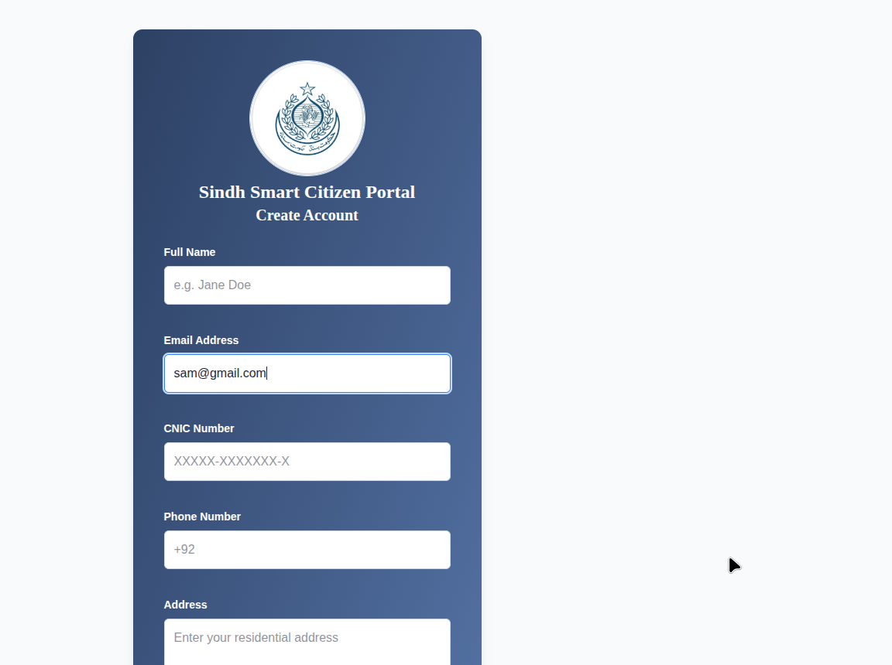

### Admin Login

Shows the admin login screen with role-specific access messaging.

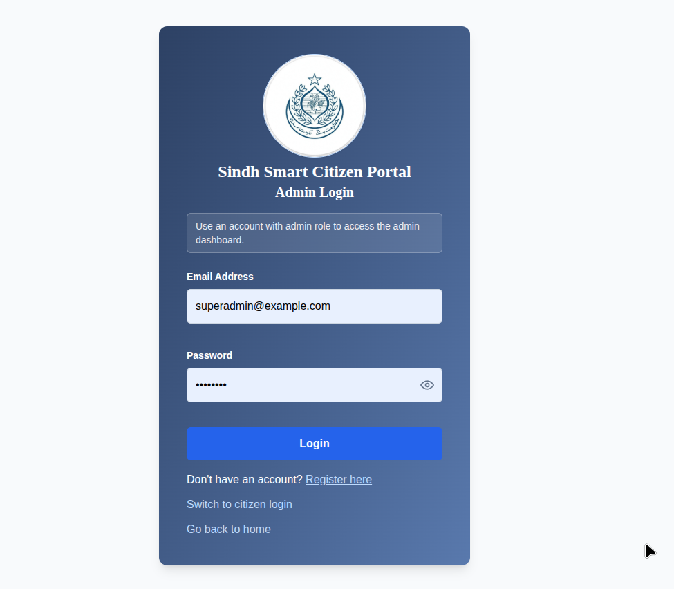

### Citizen Dashboard

Shows complaint stats, quick actions, recent complaints, and announcements.

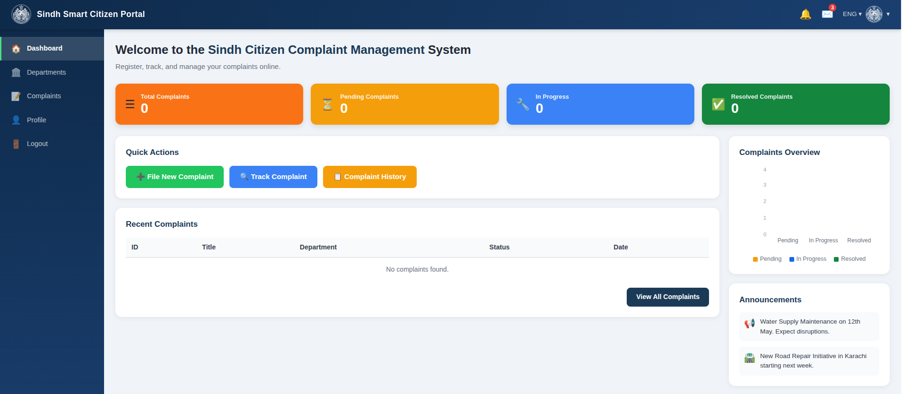

### Complaint Management

Shows complaint submission and complaint history for citizens.

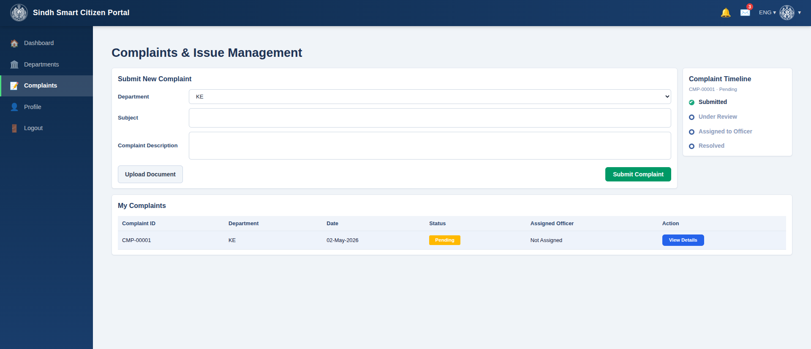

### Citizen Profile

Shows profile details, complaint stats, and login activity.

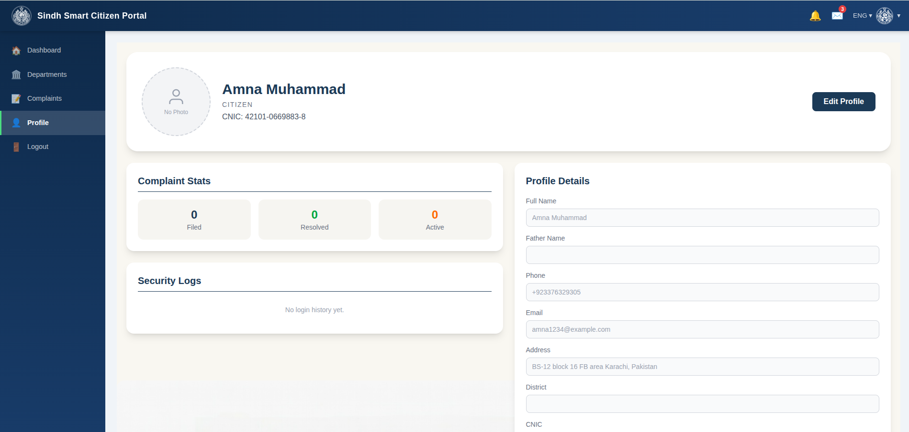

### Departments Page

Shows the departments available for complaint routing.

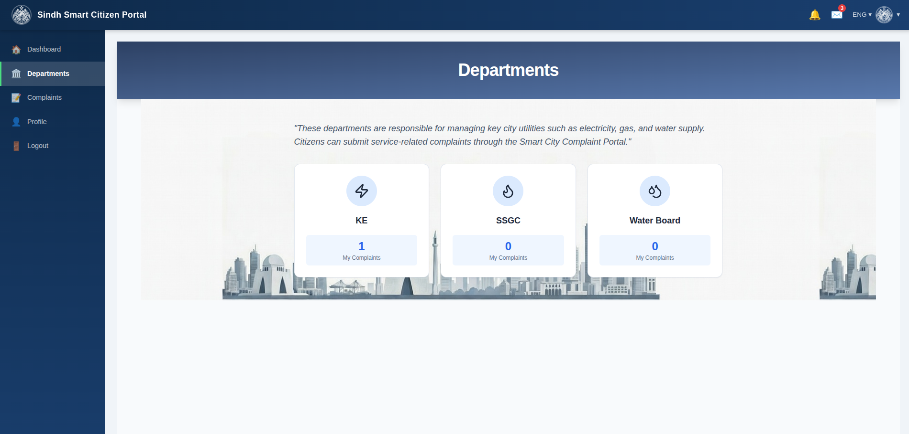

### Admin Dashboard

Shows total complaints, status cards, and recent complaint records.

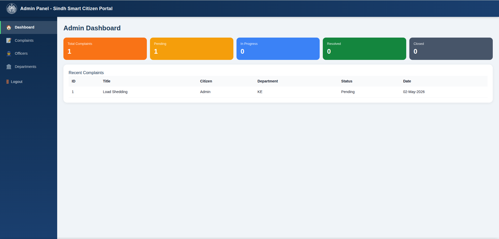

### Admin Complaints Panel

Shows complaint filtering and complaint detail management for administrators.

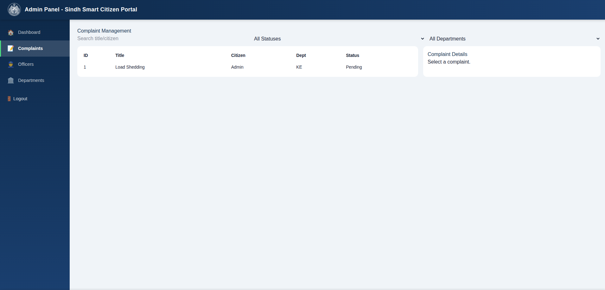

### Admin Officers Panel

Shows officer creation and officer listing by department.

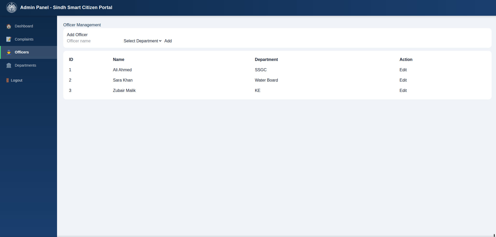

### Admin Departments Panel

Shows department creation and department management.

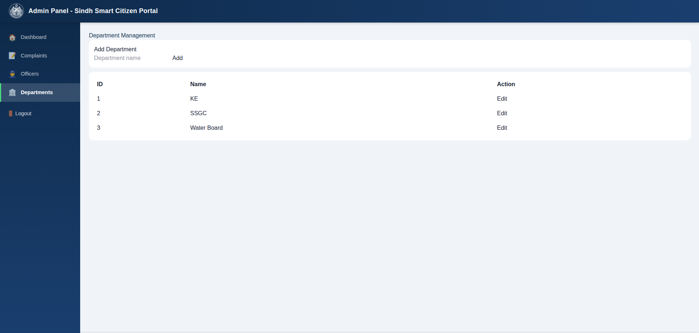

## Notes

- The frontend proxies `/api` requests to `http://localhost:5000`.
- The backend uses Oracle for persistent storage.
- `oracle-backend/.env` is intentionally ignored by Git.
